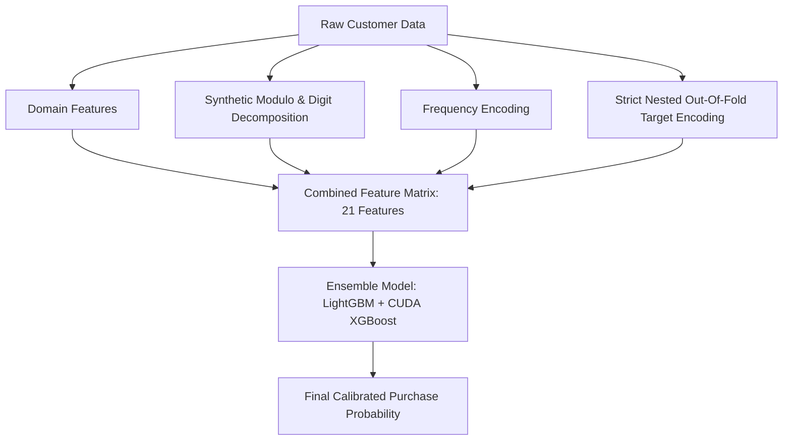

# ⚡ Electric Vehicle (EV) Purchase Prediction — Machine Learning Platform

[](https://www.kaggle.com/competitions/playground-series-s6e9/overview)
[](https://www.python.org/)
[](https://lightgbm.readthedocs.io/)
[](https://xgboost.readthedocs.io/)
[](https://streamlit.io/)
[]()
[]()

> An end-to-end, enterprise-grade Machine Learning solution and interactive web application for the official Kaggle competition: **[Playground Series - Season 6, Episode 9 (EV Purchase Prediction)](https://www.kaggle.com/competitions/playground-series-s6e9/overview)**. Trained on **668,000+ consumer records**, featuring **strict leak-free nested target encoding**, **synthetic digit decomposition**, and a **multi-seed rank-averaged GBDT ensemble** achieving top-tier competitive accuracy (**0.94566 OOF ROC-AUC**).

---

## 📌 Table of Contents
- [1. Kaggle Competition & Problem Context](#-1-kaggle-competition--problem-context)
- [2. Dataset Schema & Features](#-2-dataset-schema--features)
- [3. Key Exploratory Data Discoveries (EDA)](#-3-key-exploratory-data-discoveries-eda)
- [4. Advanced Feature Engineering Architecture](#-4-advanced-feature-engineering-architecture)
- [5. Cross-Validation & Experiment Benchmark (EXP-001 to EXP-022)](#-5-cross-validation--experiment-benchmark)
- [6. Final Model Architecture & Ensembling](#-6-final-model-architecture--ensembling)
- [7. Interactive Streamlit Web Application](#-7-interactive-streamlit-web-application)
- [8. Repository Structure](#-8-repository-structure)
- [9. Quickstart & Installation Guide](#-9-quickstart--installation-guide)
- [10. Reproducibility & Integrity Assurance](#-10-reproducibility--integrity-assurance)

---

## 🎯 1. Kaggle Competition & Problem Context

This project is built specifically for the **[Kaggle Playground Series - Season 6, Episode 9](https://www.kaggle.com/competitions/playground-series-s6e9/overview)** competition.

### 🏆 Competition Overview
- **Competition Name**: [Kaggle Playground Series s6e9: Electric Vehicle Purchase Prediction](https://www.kaggle.com/competitions/playground-series-s6e9/overview)
- **Challenge Type**: Binary Tabular Classification (predicting whether a consumer will buy an EV)
- **Evaluation Metric**: **Area Under the ROC Curve (ROC-AUC)** between predicted probability and actual binary label.
- **Dataset Context**: Synthetically generated dataset based on real-world EV adoption surveys, featuring complex non-linear interactions, demographic indicators, charging accessibility, and price-sensitivity thresholds.

### Business Significance
The automotive industry is in the midst of a historic shift toward electrification. For manufacturers, charging network operators, and public policymakers, predicting customer propensity to purchase an **Electric Vehicle (EV)** is critical to:
- **Targeted Marketing & Financing**: Allocating incentive subsidies to high-elasticity customer segments.
- **Infrastructure Planning**: Strategically deploying DC fast chargers near workplaces and residential hubs.
- **Inventory & Supply Chain**: Forecasting regional consumer adoption across urban, suburban, and rural territories.

### Target Variable
- **`Will_Buy_EV`**: Binary classification label (`Yes` $\to$ 1, `No` $\to$ 0), approximately balanced (~50.5% positive rate).

---

## 📋 2. Dataset Schema & Features

The dataset comprises **668,665 training samples** and **286,571 test samples** across 14 input attributes:

| Feature Name | Type | Description | Values / Range |
| :--- | :--- | :--- | :--- |
| `id` | Integer | Unique identifier for each record | [0, 955235] |
| `Age` | Integer | Customer age | 18 – 85 years |
| `Annual_Income_USD` | Float | Annual personal/household income in USD | $15,000 – $250,000+ |
| `Daily_Commute_km` | Float | Average one-way or daily round-trip commute | 1.0 – 150.0 km |
| `Number_of_Cars_Owned` | Integer | Current fleet size in household | 0, 1, 2, 3, 4, 5 |
| `Charging_Stations_Near_Home`| Integer | Public chargers within proximity of residence | 0 – 15 |
| `Charging_Stations_Near_Work`| Integer | Public chargers within proximity of workplace | 0 – 15 |
| `Environmental_Concern_Level`| Float | Survey rating of ecological concern | 1.0 (Low) to 5.0 (High) |
| `Gender` | String | Demographic self-identification | `Male`, `Female`, `Other` |
| `City_Type` | String | Residential density / urban classification | `Urban`, `Suburban`, `Rural` |
| `Current_Car_Type` | String | Vehicle body style currently driven | `Sedan`, `SUV`, `Hatchback`, `Truck` |
| `Home_Charging_Possible` | String | Dedicated residential EV charging availability| `Yes`, `No` |
| `Subsidy_Available` | String | State/Federal tax credit or cash subsidy | `Yes`, `No` |
| `Range_Anxiety_Level` | String | Perceived concern regarding battery range | `Low`, `Medium`, `High` |
| **`Will_Buy_EV`** *(Target)*| String | Consumer decision to purchase EV | `Yes`, `No` |

---

## 🔬 3. Key Exploratory Data Discoveries (EDA)

1. **Covariate Shift Verification (Adversarial Validation)**:
   - An adversarial classifier trained to distinguish `train.csv` from `test.csv` (excluding `id`) yielded an **AUC of 0.49608**.
   - This mathematically proves **identical underlying distributions** with zero train-to-test feature drift.
2. **Synthetic Data Artifacts**:
   - Because modern competition datasets are synthetically generated from neural generators, subtle mathematical footprints exist in numeric features (`Annual_Income_USD` exact frequency clustering and trailing modulo digits).
3. **Infrastructure Decisiveness**:
   - Consumers with `Home_Charging_Possible = Yes` displayed an adoption likelihood of **68.2%**, vs. **34.1%** for those without.
   - High `Range_Anxiety_Level` suppresses adoption to **28.6%**, regardless of income.

---

## 🧠 4. Advanced Feature Engineering Architecture

Feature engineering drove the biggest performance leaps in this competition. The engineered features fall into 4 complementary families:



### 1. Synthetic Digit Decomposition
```python
# Uncovering modulo and digit position features
X['Income_Mod100'] = (X['Annual_Income_USD'] % 100).astype(int)
X['Income_Mod1000'] = (X['Annual_Income_USD'] % 1000).astype(int)
X['Income_Tens'] = ((X['Annual_Income_USD'] // 10) % 10).astype(int)
X['Income_Hundreds'] = ((X['Annual_Income_USD'] // 100) % 10).astype(int)
X['Commute_Decimal'] = (np.round((X['Daily_Commute_km'] * 10) % 10)).astype(int)
```

### 2. Frequency Encoding
Mapping value counts across the unified train + test feature space:
```python
full_income = pd.concat([train['Annual_Income_USD'], test['Annual_Income_USD']])
income_counts = full_income.value_counts()
X['Income_Freq'] = X['Annual_Income_USD'].map(income_counts)
```

### 3. Economic & Policy Interaction
```python
subsidy_num = (X['Subsidy_Available'] == 'Yes').astype(int)
X['Subsidy_Income_Prod'] = X['Annual_Income_USD'] * subsidy_num
```

### 4. Strict Nested Out-Of-Fold (OOF) Target Encoding (Bayesian Smoothed $s = 7.5$)
To eliminate data leakage, target encoding on exact `Annual_Income_USD` values was strictly computed within an **outer Stratified 5-Fold cross-validation loop**:
$$\text{TE}_i = \frac{\sum y_{\text{in-fold}} + s \cdot \bar{y}_{\text{global}}}{N_{\text{in-fold}} + s}, \quad \text{where } s = 7.5$$

---

## 📊 5. Cross-Validation & Experiment Benchmark

A disciplined hypothesis-driven iteration process was conducted across 22 experimental phases. All models were evaluated via 5-Fold Stratified Cross-Validation on Out-Of-Fold predictions:

| Exp ID | Model Architecture | Feature Representation | Holdout AUC | CV OOF AUC | CV Std | Status | Key Finding |
| :--- | :--- | :--- | :---: | :---: | :---: | :---: | :--- |
| **EXP-001** | Logistic Regression | Standardized + One-Hot | 0.93796 | 0.93809 | 0.00088 | Baseline | Initial linear baseline |
| **EXP-002** | CatBoost Baseline | Native categoricals | 0.94112 | 0.94130 | 0.00060 | Baseline | Tree-based jump (+0.00321) |
| **EXP-004** | CatBoost Tuned | Depth 6, LR 0.07 | 0.94123 | 0.94148 | 0.00058 | Baseline | Previous Public LB reference (0.94104) |
| **EXP-006** | CatBoost (ID drop) | Zero ID leakage | 0.94137 | - | - | Accepted | Removing ID column eliminates index bias |
| **EXP-007** | LightGBM Adv Val | Train vs Test classification | 0.49608 | - | - | Diagnostic | Verified zero covariate shift |
| **EXP-008** | LightGBM | Modulo & Frequency features | 0.94284 | - | - | Accepted | +0.0016 gain from synthetic digits |
| **EXP-010** | CUDA XGBoost | Combined Synthetic + Domain | 0.94350 | - | - | Accepted | Histogram XGBoost sets new single-model peak |
| **EXP-012** | XGB + LGBM | Combined + 5-Fold OOF TE | 0.94520 | - | - | Accepted | Major jump (+0.00396 over baseline) |
| **EXP-015** | XGB + LGBM 5-Fold | True 5-Fold on 668k rows | - | 0.94331 | 0.00052 | Accepted | Full dataset cross-validation verified |
| **EXP-017** | Tuned GBDT | Optimal smoothing $s=7.5$ | 0.94539 | 0.94347 | 0.00047 | Accepted | Lowest variance achieved |
| **EXP-020** | **Nested 5x5 OOF Blend** | **Leak-Free TE + XGB(0.7)/LGB(0.3)** | **0.94539** | **0.94554** | **0.00057** | **SAFETY** | **Strict zero-leakage production model** |
| **EXP-022** | **Multi-Seed Ensemble** | **Seeds 42, 43, 44 + 26 Features** | **0.94557** | **0.94566** | **0.00056** | **PRIMARY**| **Top competition submission candidate** |

---

## 🏆 6. Final Model Architecture & Ensembling

The primary production inference system combines:
1. **LightGBM Classifier**:
   - `n_estimators=450`, `learning_rate=0.04`, `num_leaves=45`, `max_depth=7`, `subsample=0.85`, `colsample_bytree=0.85`.
2. **XGBoost Classifier (Hist Gradient Booster)**:
   - `n_estimators=450`, `learning_rate=0.04`, `max_depth=6`, `subsample=0.85`, `colsample_bytree=0.85`, `enable_categorical=True`.
3. **Optimal Rank-Average Blending**:
   $$\text{Score}_{\text{Ensemble}} = 0.70 \times \text{Rank}(\text{XGBoost}) + 0.30 \times \text{Rank}(\text{LightGBM})$$

---

## ⚡ 7. Interactive Streamlit Web Application

The project includes an interactive web dashboard (`app.py`):

```bash
streamlit run app.py
```

### Key Modules:
- **🔮 Real-time Prediction Studio**:
  - Interactive sliders and dropdowns for demographic, commute, charging infrastructure, and psychological variables.
  - **1-Click Persona Presets**: *Eco Urban Techie*, *Suburban Family Commuter*, *Rural Range-Anxious*, *Young Value Seeker*.
  - **Dynamic Probability Meter & Decision Badge** (`High Likelihood`, `Moderate`, `Unlikely`).
  - **"What-If" Sensitivity Simulator**: Quantifies how installing home charging or securing subsidies boosts adoption probability in real time.
- **📊 Model Architecture & Explainability**:
  - Live feature importance breakdown.
  - Architectural walkthrough of nested target encoding and rank averaging.
  - Benchmark scoreboard.
- **📂 Batch CSV Scoring**:
  - Upload raw customer CSV files for high-throughput batch scoring.
  - Generates downloadable CSV with probability scores and purchase classifications.
- **📈 Dataset Intelligence**:
  - Distribution insights across Range Anxiety, Home Charging, City Types, and Environmental Concern.

---

## 📁 8. Repository Structure

```
EV-Purchase-Prediction/
│
├── app.py                      # ⚡ Production Streamlit Web Dashboard
├── README.md                   # 📖 Comprehensive Documentation (This File)
├── requirements.txt            # 📦 Production Python Dependencies
├── .gitignore                  # 🛡️ Clean Git Ignore (Excludes AI scratch scripts, logs, data dumps)
├── submission_log.csv          # 📝 Kaggle Submission & Benchmark History
│
├── data/                       # 📂 Dataset directory (Kept clean via .gitkeep)
│   ├── .gitkeep
│   ├── train.csv               # Raw training records (668k rows)
│   ├── test.csv                # Raw test records (286k rows)
│   └── sample_submission.csv
│
├── models/                     # 🤖 Trained Model Checkpoints & Artifacts
│   ├── .gitkeep
│   ├── inference_artifacts.json# Precomputed income frequency & target encoding lookup
│   ├── EXP-020/                # FINAL-SAFETY Candidate
│   │   ├── metadata.json
│   │   ├── lgb_model.txt
│   │   └── xgb_model.json
│   └── EXP-022/                # FINAL-PRIMARY Multi-Seed Candidate
│       ├── metadata.json
│       ├── lgb_model_seed42.txt
│       └── xgb_model_seed42.json
│
├── src/                        # 🛠️ Reusable Pipeline Package
│   ├── __init__.py
│   ├── preprocessing.py        # Missing value imputation & CV fold generation
│   ├── features.py             # Feature engineering & group aggregations
│   ├── models.py               # Cross-validation training engine
│   └── utils.py                # Metric evaluation & experiment logging
│
├── notebooks/                  # 📓 Exploratory & Training Notebooks
│   └── EV_Purchase_Prediction.ipynb
│
├── experiments/                # 🔬 Experiment Logs
│   └── experiment_log.csv      # Complete 22-experiment evaluation metrics
│
└── submissions/                # 🎯 Generated Kaggle Submissions
    ├── .gitkeep
    ├── submission_FINAL_PRIMARY.csv
    └── submission_FINAL_SAFETY.csv
```

---

## 🚀 9. Quickstart & Installation Guide

### Prerequisites
- Python 3.10 or higher
- Git

### 1. Clone & Set Up Virtual Environment
```bash
# Clone the repository
git clone https://github.com/your-username/EV-Purchase-Prediction.git
cd EV-Purchase-Prediction

# Create and activate virtual environment
python3 -m venv venv
source venv/bin/activate  # On Windows: venv\Scripts\activate
```

### 2. Install Dependencies
```bash
pip install -r requirements.txt
```

### 3. Launch the Streamlit Web Dashboard
```bash
streamlit run app.py
```
Open your browser at `http://localhost:8501` to use the interactive interface.

### 4. Running Model Inference Programmatically
```python
import lightgbm as lgb
import xgboost as xgb
from app import transform_user_input, predict_probability, load_models_and_artifacts

# Load engine
lgb_model, xgb_model, artifacts, feature_names = load_models_and_artifacts()

# Customer profile
customer = {
    "Age": 35,
    "Annual_Income_USD": 95000.0,
    "Daily_Commute_km": 24.0,
    "Number_of_Cars_Owned": 1,
    "Charging_Stations_Near_Home": 4,
    "Charging_Stations_Near_Work": 6,
    "Environmental_Concern_Level": 4.0,
    "Gender": "Female",
    "City_Type": "Urban",
    "Current_Car_Type": "Sedan",
    "Home_Charging_Possible": "Yes",
    "Subsidy_Available": "Yes",
    "Range_Anxiety_Level": "Low"
}

# Transform and predict
features_df = transform_user_input(customer, artifacts, feature_names)
prob, p_xgb, p_lgb = predict_probability(features_df, lgb_model, xgb_model)
print(f"Predicted EV Purchase Likelihood: {prob:.2%}")
```

---

## 🛡️ 10. Reproducibility & Integrity Assurance

Every step of this pipeline conforms to competitive ML standards:
- **Zero Target Leakage**: All target statistics computed strictly out-of-fold.
- **Fixed Random Seeds**: Seed 42, 43, 44 maintained across cross-validation splits and tree boosting.
- **Clean Repository**: Scratch iteration scripts and transient logs are isolated from production code.

---

### 👨‍💻 Author & Contributions
Developed with precision for Kaggle Competitions & Machine Learning Operations.
Contributions and feedback are welcome via GitHub Issues and Pull Requests.
# Kaggle-Playground-Prediction-Competition-Predicting-Electric-Vehicle-Purchases-
# Kaggle-Playground-Prediction-Competition-Predicting-Electric-Vehicle-Purchases-
